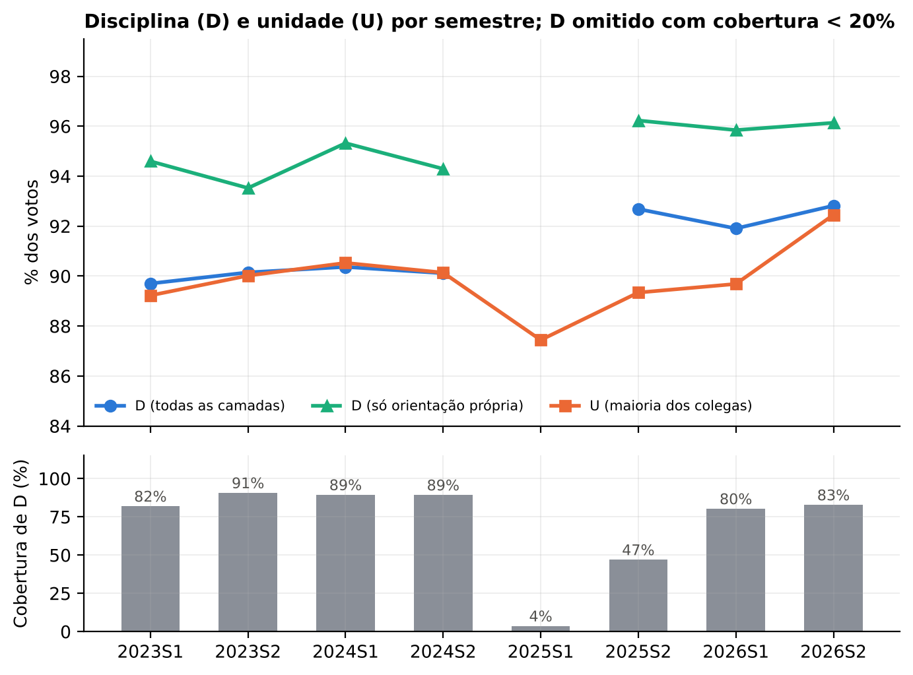
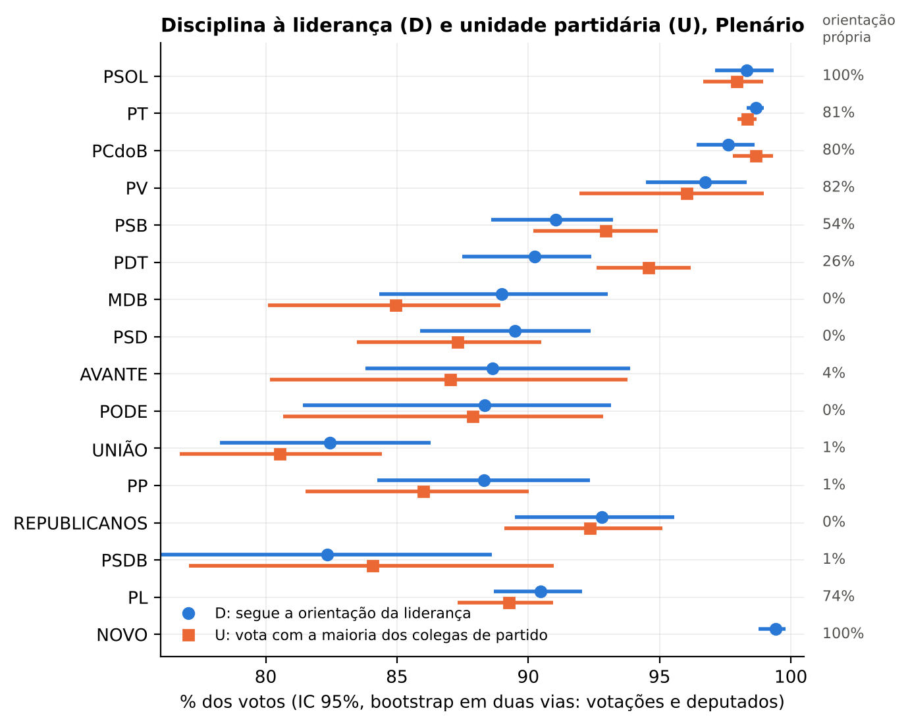
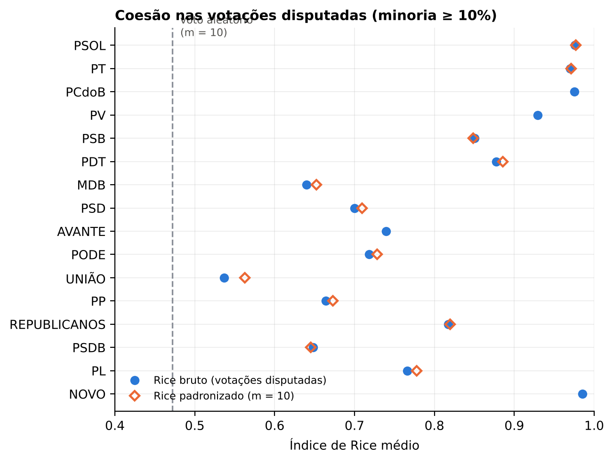
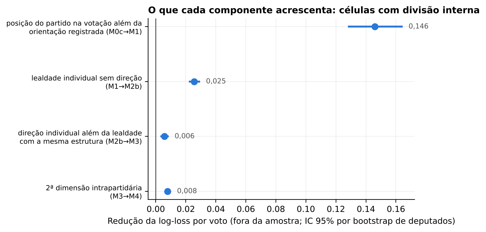
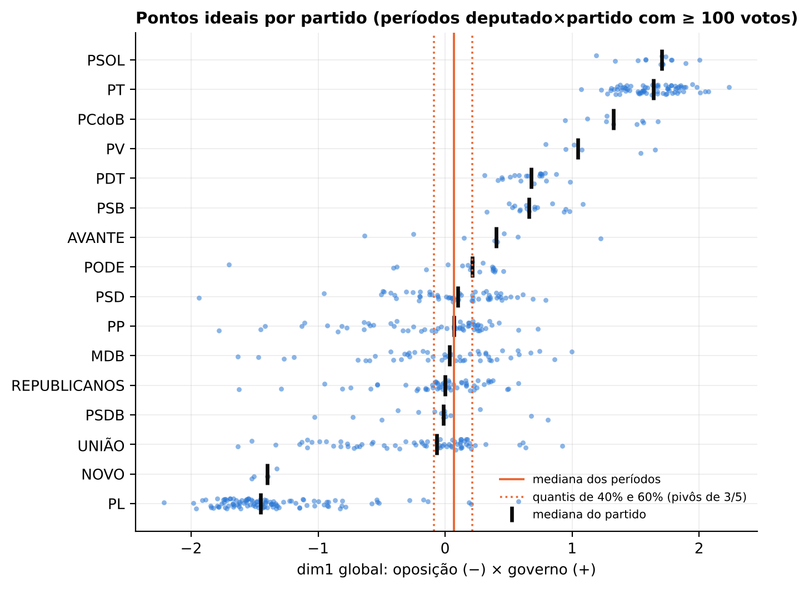
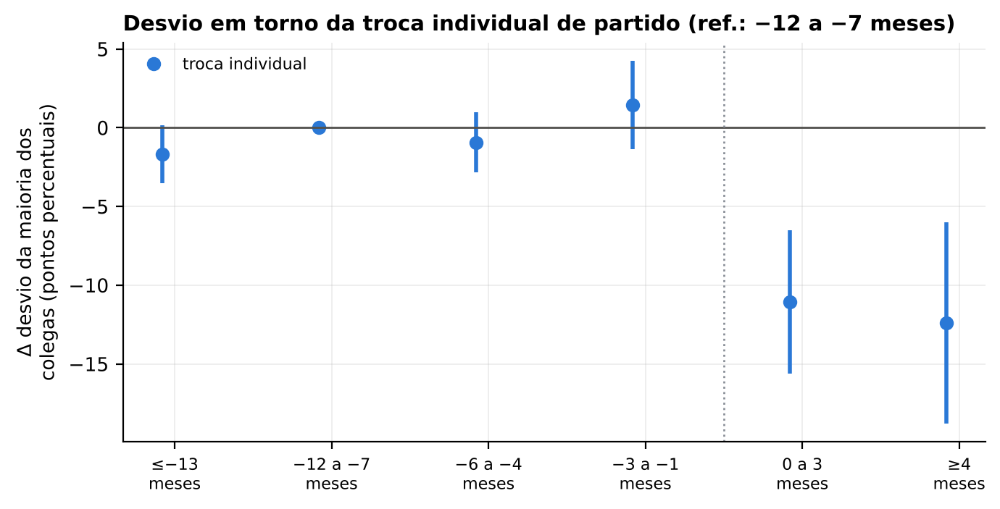
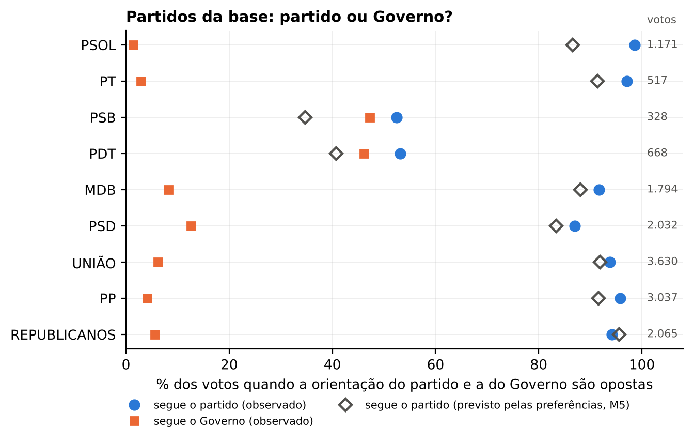

# Disciplina à liderança, unidade partidária e dissidência estruturada na Câmara dos Deputados (57ª Legislatura, 2023–2026)

**Resumo.** Analisamos {{int:n_votos_plen}} votos nominais em {{int:n_votacoes_plen}} votações do Plenário da Câmara dos Deputados ({{data:data_primeira}} a {{data:data_ultima}}) para medir a disciplina partidária e testar se a indisciplina tem estrutura. Primeiro, mostramos um problema de medida: para os partidos de centro, a orientação registrada é a do bloco, e em 2025 o registro de um megabloco que reunia o PL e a federação do PT ficou quase sempre vazio, embora as notas taquigráficas mostrem os partidos orientando em Plenário. A disciplina à liderança medida pelo registro sobe em 2025 por artefato; a unidade com a maioria dos colegas, que não depende do registro, cai em quatro partidos de centro (PSD, MDB, PP e União). Por isso usamos, ao lado da disciplina à liderança (D, {{pct:disc_geral}}%), a unidade (U, {{pct:unidade_geral}}%). Segundo, em validação cruzada, a direção individual da dissidência melhora a previsão do voto além de uma propensão individual de desvio com a mesma estrutura de parâmetros; o ganho é pequeno, mas o intervalo exclui zero. A dimensão de dissidência é o eixo governo–oposição recortado dentro de cada partido. A distância espacial ao partido domina os correlatos do desvio; depois de trocar de partido, o deputado passa a votar mais com os novos colegas; e, quando partido e Governo divergem, a base segue o partido além do que preveem as preferências estimadas.

**Palavras-chave:** disciplina partidária; orientação de bancada; blocos parlamentares; pontos ideais; Câmara dos Deputados; votações nominais.

**Abstract.** We analyse {{inten:n_votos_plen}} roll-call votes in {{inten:n_votacoes_plen}} floor votes of the Brazilian Chamber of Deputies ({{dataen:data_primeira}} to {{dataen:data_ultima}}) to measure party discipline and test whether indiscipline is structured. First, we document a measurement problem: for centrist parties the recorded recommendation is the bloc's, and in 2025 the record of a mega-bloc joining PL and the PT federation was almost always empty, although the floor transcripts show the parties issuing recommendations. Discipline measured from the record rises in 2025 as an artefact, while unity with the majority of one's colleagues, which does not depend on the record, falls in four centrist parties (PSD, MDB, PP and União). We therefore report, next to discipline to the leadership (D, {{pcten:disc_geral}}%), party unity (U, {{pcten:unidade_geral}}%). Second, in cross-validation, the individual direction of dissent improves vote prediction beyond an individual propensity to defect with the same parameter structure; the gain is small but its interval excludes zero. The dissent dimension is the government–opposition axis within each party. Spatial distance from the party dominates the correlates of defection; after switching parties, deputies vote more with their new colleagues; and when party and government disagree, coalition deputies follow the party beyond what estimated preferences predict.

**Keywords:** party discipline; party recommendations; legislative blocs; ideal points; Brazilian Chamber of Deputies; roll-call votes.

---

## 1. Introdução

Desde Figueiredo e Limongi (1999), sabe-se que os deputados brasileiros votam, em regra, com a orientação de seus líderes, contra a expectativa de partidos fracos e deputados individualistas (Mainwaring, 1999; Ames, 2001). Este artigo revisita a questão na 57ª Legislatura (2023–2027), sob o terceiro governo Lula, com duas perguntas. A primeira é de **medida**: quanta disciplina há, e o que a orientação registrada pela Câmara de fato mede? A segunda é de **estrutura**: a indisciplina é ruído ou tem uma direção individual estável e interpretável, que acrescenta algo à posição coletiva do partido? Duas perguntas derivadas completam a análise: quem desvia e o que acontece quando o partido e o Governo orientam em sentidos opostos.

A contribuição de medida parte de uma constatação sobre o registro. A Câmara publica a orientação de cada bancada — partido, federação ou bloco —, e a prática é tratar a orientação aplicável ao deputado como "orientação do partido". Na 57ª Legislatura, a bancada aplicável é o próprio partido ou federação em só {{pct:plen_camada_share_própria}}% dos votos; nos demais, é um bloco. Entre fevereiro e agosto de 2025, a bancada aplicável à maioria dos deputados foi um megabloco formado em fevereiro de 2025, no início do biênio da nova Mesa, que reunia o PL e a federação do PT. A linha desse bloco no registro ficou vazia em {{int:reg_mb_vazias}} das {{int:reg_mb_linhas}} votações, e não houve nenhuma linha própria do PL ou da federação do PT ({{int:reg_mb_linhas_partido_PL_PT}} linhas). As notas taquigráficas, porém, mostram os partidos orientando ("o PL orienta 'sim'"). Reconstruímos essas orientações faladas para mostrar que houve orientação onde o registro está vazio, e mostramos que a disciplina medida pelo registro sobe em 2025 por artefato, enquanto a unidade com os colegas cai em quatro partidos de centro. Propomos reportar lado a lado a disciplina à liderança (D), estratificada pela fonte da orientação e acompanhada da cobertura, e a unidade partidária (U), definida pela maioria dos demais colegas, que não depende do registro.

A contribuição de estrutura é um teste fora da amostra. Comparamos uma sequência de modelos, da regra "segue a orientação" a modelos de pontos ideais intrapartidários, e isolamos o valor da **direção** individual da dissidência do valor de uma **propensão** individual a desviar com a mesma estrutura de parâmetros. Interpretamos a dimensão resultante pelas votações que mais a carregam e por uma validação externa: as trocas de partido de 2026. Tratamos a troca de partido como estudo de evento e a divergência entre partido e Governo com contrafactuais dados pelas preferências estimadas.

## 2. Literatura e expectativas

**Disciplina, coesão e agenda.** O índice de Rice (Rice, 1925) mede a coesão de um grupo numa votação. Ele é inflado em grupos pequenos (Desposato, 2005) e confunde coesão com consenso, o que leva a restringir a análise a votações disputadas ou a ponderar pela disputa. Carey (2007; 2009) mostra que a unidade de voto é menor onde "principais concorrentes" — eleitores, governadores, o presidente — disputam a lealdade do legislador; seguindo Krehbiel (1993), distinguimos *unidade* (votar junto) de *disciplina* no sentido estrito (votar com o líder contra a própria preferência). A medida D adiante é adesão à orientação; só o excesso de lealdade da seção 5.8 aproxima o componente contra a preferência. No Brasil, Figueiredo e Limongi (1999) atribuem a disciplina à centralização dos trabalhos no Colégio de Líderes combinada aos poderes de agenda do Executivo, como medidas provisórias e pedidos de urgência (resumo de fontes secundárias; a lista completa dos instrumentos no original fica [verificar]). Amorim Neto, Cox e McCubbins (2003) analisam o poder de agenda das coalizões na Câmara. Pereira e Mueller (2004) ligam o voto com o Governo à execução de emendas orçamentárias. Cheibub, Figueiredo e Limongi (2009) discutem partidos e governadores como determinantes do comportamento legislativo. Nicolau (2000) documenta a disciplina no primeiro governo Fernando Henrique. A coesão observada é também produto da agenda (Cox e McCubbins, 2005) e da seleção de quais votações são nominais (Carrubba, Gabel e Hug, 2008): só {{pct:share_plen_nominais}}% das {{int:n_votacoes_plen_todas}} votações de Plenário da legislatura tiveram votos nominais.

**Preferência ou partido.** Krehbiel (1993) argumenta que coesão não prova influência do partido. Snyder e Groseclose (2000) comparam votações disputadas e lopsided para estimar a pressão partidária, e McCarty, Poole e Rosenthal (2001) modelam linhas de corte por partido. Clinton, Jackman e Rivers (2004) formalizam a estimação de pontos ideais; Bafumi et al. (2005) e Lauderdale (2010) tratam de identificação e de votantes imprevisíveis. Zucco (2009) e Zucco e Lauderdale (2011) mostram que o comportamento dos deputados brasileiros responde a influências do Executivo além da ideologia; Power e Zucco (2009) fornecem âncoras de ideologia partidária. Minozzi e Volden (2013) estudam quem atende ao chamado do partido. Sobre trocas de partido, Desposato (2006) explica as migrações na Câmara por ambição e ideologia, Heller e Mershon (2005) as estudam na Itália, e Nokken (2000) estuda a dinâmica da lealdade e da defecção de legisladores no Congresso americano, inclusive dos que trocam de partido. Black (1948) e Krehbiel (1998) justificam olhar o mediano e os pivôs de maioria qualificada.

**Expectativas e critérios de falha.** O plano de análise foi escrito depois da análise descritiva preliminar. Por isso E1 e E2 são leituras descritivas, e E3 a E5 foram especificadas antes das análises que as testam (Apêndice B). Os **limiares numéricos de falha**, porém, foram fixados na revisão, depois de conhecidos os resultados, e devem ser lidos como critérios declarados, não pré-registrados.

- **E1** (Figueiredo e Limongi): disciplina alta e estável. *Falha* se a diferença entre o ano de maior e o de menor unidade (U) passar de 3 pontos percentuais.
- **E2** (Desposato; Carey): o ordenamento dos partidos por coesão não depende de tamanho nem de disputa. *Falha* se a correlação de postos entre o Rice bruto e o padronizado, ou entre limiares de disputa, ficar abaixo de 0,8.
- **E3** (Krehbiel; Clinton, Jackman e Rivers): se a dissidência é preferência individual estruturada, a direção individual prevê melhor que uma propensão a desviar com a mesma estrutura de parâmetros. *Falha* se o IC da redução de log-loss de M2b para M3 incluir zero.
- **E4** (Zucco): a dimensão de dissidência é o eixo governo–oposição. *Falha* se a correlação entre a carga das votações e a orientação do Governo ficar abaixo de 0,5.
- **E5** (Figueiredo e Limongi contra Carey): quando partido e Governo divergem, a liderança do partido prevalece além das preferências (excesso de lealdade positivo); os principais concorrentes de Carey preveem excesso menor onde a orientação vem do bloco. *Falha* se o IC do excesso incluir zero nos dois contrafactuais.

## 3. Dados

Os dados são os Dados Abertos da Câmara para a 57ª Legislatura, coletados até 11/11/2026: {{int:n_votos_total}} votos válidos em {{int:n_votacoes_total}} votações nominais, dos quais {{int:n_votos_plen}} em {{int:n_votacoes_plen}} votações do Plenário, de {{int:n_deputados_plen}} deputados (titulares e suplentes). Excluímos os {{int:n_artigo17}} registros "Artigo 17" (o presidente da sessão não vota), votos sem registro e deputados sem partido. Usamos o partido do deputado **na data** de cada votação. O cadastro "atual" reflete a janela partidária de 2026: entre março e maio de 2026 ocorreram {{int:n_transicoes_janela2026}} das {{int:n_transicoes_individuais}} trocas individuais de partido. Das {{int:n_transicoes}} transições registradas, {{int:n_transicoes_fusao}} são fusões ou incorporações (PSC→PODE, PATRIOTA→PRD, PTB→PRD, PROS→SOLIDARIEDADE), tratadas à parte. A Tabela 1 distribui as votações por tipo e ano. O tipo é atribuído por regras sobre o texto da votação; numa amostra estratificada de 120 votações codificadas pelo assistente de IA que conduziu a análise, a partir da leitura das descrições, sem segundo codificador (das quais {{int:classif_n}} codificáveis), as regras acertam {{pct:classif_acuracia}}%, e os erros se concentram em recursos e emendas de redação.

{{tab:tab1_votacoes_tipo_ano}}

**Orientações registradas.** Para cada voto, associamos a orientação da bancada aplicável ao partido do deputado na data — o próprio partido; senão, a federação; senão, o bloco — e as orientações do Governo, da Maioria, da Minoria e da Oposição. Como a Câmara publica nomes de blocos truncados, partidos sem orientação própria são atribuídos ao bloco por inferência (cerca de {{pct0:todos_fonte_share_inferido}}% de todos os votos). Classificamos cada voto em camadas, com as parcelas dos votos do Plenário:

- **própria** (partido ou federação): {{pct:plen_camada_share_própria}}%;
- **bloco**: {{pct:plen_camada_share_bloco}}%;
- **bloco inferido**: {{pct:plen_camada_share_bloco inferido}}%;
- **bloco heterogêneo**: {{pct:plen_camada_share_bloco heterogêneo}}%. É o megabloco de {{data:megabloco_data_ini}} a {{data:megabloco_data_fim}}, que não conta como orientação do partido.

"Liberado" e orientação vazia ficam fora da medida de disciplina.

**Orientações faladas.** Extraímos das transcrições dos discursos as orientações anunciadas em Plenário ("o PL orienta 'sim'") e associamos cada uma à primeira votação nominal registrada até 45 minutos depois. Foram {{int:fala_n_associadas}} orientações associadas a votações ({{int:fala_mb_n_estrito}} dos votos no megabloco vêm de falas com o verbo "orienta"). Onde há registro oficial da orientação do próprio partido ({{int:fala_val_n}} casos), fala e registro coincidem em {{pct:fala_val_concorda}}%. Numa conferência de {{int:fala_manual_n}} associações sorteadas, feita pelo mesmo assistente de IA a partir da leitura das falas e das votações, sem segundo codificador, o objeto da fala (retirada de pauta, destaque, urgência, mérito) é compatível com a votação associada em {{int:fala_manual_corretas}} e incerto em {{int:fala_manual_incertas}}. O método tem vieses conhecidos. Capta só a fórmula "o partido orienta/vota ‘x’", não as orientações dadas de outro modo ou só no painel. Pode associar a fala à votação errada quando há várias votações em sequência. E sobrerrepresenta partidos cujos líderes falam mais. Por isso a usamos como evidência de que houve orientação, e não como medida do nível de disciplina.

**Exercício do mandato.** A partir do histórico de situação dos deputados, reconstruímos os períodos de exercício e a condição (titular ou suplente) em cada data. Nas {{int:presenca_n_datas}} datas com votação nominal há em média {{d1:presenca_media_em_exercicio}} deputados em exercício, e em {{pct:presenca_share_datas_513_mais_menos_5}}% delas o total fica a no máximo cinco de 513.

## 4. Método

### 4.1 Disciplina, unidade e coesão

Seja $s(v_{ij})=1$ para Sim e $0$ para Não ou Obstrução no voto do deputado $i$ na votação $j$, e $o_{pj}$ a orientação diretiva da bancada aplicável ao partido $p$. A obstrução é um instrumento de quórum: um Não de quem recebeu ordem de obstruir não é dissidência quanto ao mérito. A **disciplina à liderança** é

$$D = \frac{1}{|\mathcal{O}|}\sum_{(i,j)\in\mathcal{O}} \mathbf{1}[s(v_{ij}) = s(o_{p(i)j})],$$

em que $\mathcal{O}$ reúne os votos (Sim, Não, Obstrução ou Abstenção) com orientação diretiva nas camadas própria, bloco ou bloco inferido. Abstenção conta como desvio, e toda taxa vem com sua **cobertura** ($|\mathcal{O}|$ dividido pelos votos válidos). A **unidade partidária** compara o deputado à maioria dos demais colegas presentes:

$$U = \frac{1}{|\mathcal{U}|}\sum_{(i,j)\in\mathcal{U}} \mathbf{1}[s(v_{ij}) = m_{-i,j}],\qquad m_{-i,j}=\mathbf{1}\Big[\textstyle\sum_{k\in p(i),k\neq i} s(v_{kj}) > \tfrac{1}{2}n_{-i,j}\Big],$$

definida quando há pelo menos cinco colegas votando e não há empate; a abstenção do deputado conta como desvio. U cobre {{pct:cobertura_U}}% dos votos; D, {{pct:cobertura_D}}%.

O índice de Rice, $R_{pj}=|S_{pj}-N_{pj}|/(S_{pj}+N_{pj})$, é calculado em células com pelo menos três votantes. Para corrigir a inflação em bancadas pequenas, usamos o valor esperado numa subamostra sem reposição de $m$ membros (Desposato, 2005), calculado exatamente pela distribuição hipergeométrica, com $m = 3$ (todos os partidos) e $m = 10$. A linha de base é o Rice de votantes independentes. As médias se restringem às {{int:n_votacoes_disputadas}} votações **disputadas** (minoria do Plenário ≥ 10%). Os intervalos das taxas por partido vêm de bootstrap em duas vias (votações e deputados).

### 4.2 Pontos ideais

Usamos o estimador de pontos ideais do projeto (regressão logística bilinear penalizada; Clinton, Jackman e Rivers, 2004), sem modificá-lo. Para o voto Sim ($y_{ij}=1$) ou Não/Obstrução ($y_{ij}=0$) do deputado $i$, no período $r$ de filiação a um partido $p$:

$$\Pr(y_{ij}=1)=\sigma\big(a_j + g_{pj} + \mathbf{b}_j^\top \mathbf{x}_{r}\big),\qquad \mathbf{x}_r=\mathbf{u}_{i}+\boldsymbol{\delta}_r,$$

com penalidades gaussianas (as do estimador do projeto; $\lambda_d = 4$ para os desvios por período) e excluídas as votações com minoria abaixo de 2,5%. O modelo **global** omite $g$. O **intrapartidário** inclui o efeito fixo partido×votação $g_{pj}$, que absorve a posição do partido em cada votação, e centra os pontos dentro de cada partido. A amostra tem {{int:irt_n_votos}} votos, {{int:irt_n_votacoes}} votações, {{int:irt_n_periodos}} períodos deputado×partido e {{int:irt_n_celulas}} células partido×votação, com mediana de {{d1:irt_celulas_mediana_votantes}} votantes por célula e {{pct0:irt_celulas_share_menos5}}% delas com menos de cinco.

### 4.3 Ruído ou estrutura

Os modelos abaixo são comparados na previsão de votos retirados: validação cruzada em cinco dobras sobre células deputado×votação, estratificada por votação, isto é, um exercício de **imputação** de votos.

- **M0**: a regra "segue a orientação" (sem orientação, a maioria de treino do partido ou da votação), com probabilidade calibrada pelo acerto no treino; **M0c** calibra por partido e fonte.
- **M1**: só $a_j+g_{pj}$, a posição coletiva do partido em cada votação, estimada com os votos dos colegas na mesma votação.
- **M2**: M1 mais uma lealdade individual sem direção, $\sigma(z^{M1}+\rho_i d_{pj})$, com $d_{pj}=\pm1$ conforme a maioria de treino da célula.
- **M2b**: lealdade por período com escala por votação, $\sigma(z^{M1}+s_j\rho_r d_{pj})$, com penalidades $\lambda_\rho = 1$ e $\lambda_s = 0{,}04$. Tem a mesma estrutura de parâmetros de M3, mas a direção do desvio é fixada como "contra a maioria do próprio partido".
- **M3** e **M4**: o modelo intrapartidário com uma e duas dimensões. **M3L** acrescenta a M3 o termo $\rho_i d_{pj}$.
- **M5**: o modelo global de duas dimensões, sem partido.

A comparação central de E3 é M2b→M3. A métrica principal é a log-loss nas **células com divisão interna**: partido×votação com pelo menos cinco colegas no treino e pelo menos um voto contra a maioria do partido no treino. São definidas só com o treino e cobrem {{pct0:cv_disputadas_intra_share}}% dos votos. Reportamos também Brier, acurácia e AUC-PR para os votos contra a maioria. Os intervalos das diferenças vêm de bootstrap de deputados sobre as perdas de teste.

### 4.4 Correlatos, troca de partido e divergência com o Governo

**Quem desvia.** Um modelo de probabilidade linear (MPL) ao nível do voto, $\text{desvio}_{ij}=\boldsymbol\beta^\top\mathbf z_i(t)+\gamma_{p(i,t)j}+\varepsilon_{ij}$, com efeito fixo partido×votação, compara deputados do mesmo partido na mesma votação. As covariáveis são:

- suplência em exercício, por motivo do afastamento do titular (pareado por UF e data);
- sexo e idade;
- log das cadeiras da unidade da federação (UF);
- troca individual de partido, antes e depois da troca;
- a distância à mediana do partido no eixo governo–oposição, estimada com as votações do **outro biênio** e expressa em desvios-padrão da dimensão.

Os erros-padrão (EP) são agrupados por deputado e por votação (Cameron, Gelbach e Miller, 2011).

**Troca de partido.** Estudo de evento com efeitos fixos de deputado e de partido×votação e janelas em meses relativos à primeira troca individual (≤ −13, −12 a −7 [referência], −6 a −4, −3 a −1, 0 a 3, ≥ 4). Como as trocas ocorrem em datas diferentes, estimamos também a versão só com a coorte da janela de 2026, com os deputados que nunca trocaram como controles (Sun e Abraham, 2021; Callaway e Sant'Anna, 2021). A pré-tendência é testada em conjunto. Para separar seleção de ajuste, comparamos a posição do deputado antes da troca com as medianas de origem e destino.

**Partido × Governo.** Selecionamos os votos em que a orientação diretiva do partido e a do Governo são opostas, entre os partidos com ministério em ao menos parte do governo: PT, PCdoB, PSB, PDT, PSOL, REDE, MDB, PSD, União, PP e REPUBLICANOS (Apêndice C). O **excesso de lealdade** é o observado menos o previsto pelo modelo global sem partido, de duas formas:

- (i) previsões de validação cruzada de M5. Como seus parâmetros já usam votos disciplinados da mesma votação, dão um **limite inferior**;
- (ii) M5 reestimado sem os votos desses partidos nas células divergentes. Tende a **superestimar** o excesso, porque as cargas dessas votações passam a vir só dos outros partidos.

## 5. Resultados

### 5.1 O que a orientação registrada mede

A disciplina é de {{pct:disc_camada_própria}}% sob orientação própria, {{pct:disc_camada_bloco}}% sob bloco e {{pct:disc_camada_bloco inferido}}% sob bloco inferido. Para União, PP, PSD, MDB, REPUBLICANOS, PODE e PSDB, menos de 2% dos votos estão sob orientação do próprio partido (Figura 2, coluna à direita): o que se chama de disciplina partidária, nesses partidos, é disciplina ao líder do bloco.

O registro de 2025 é o caso extremo. Em D, a disciplina sobe para {{pct:disc_ano_2025}}% em 2025, contra {{pct:disc_ano_2023}}% em 2023, mas a cobertura de D cai a {{pct0:cobD_ano_2025}}%, contra {{pct0:cobD_ano_2023}}% (Figura 1). Nas votações do megabloco, o registro sempre traz as linhas de Governo, Maioria, Minoria e Oposição ({{int:reg_mb_linhas_oposicao}} linhas de Oposição em {{int:megabloco_n_votacoes}} votações), mas nenhuma linha própria do PL ou da federação do PT. As transcrições, porém, mostram esses partidos orientando: as orientações faladas cobrem {{int:fala_mb_votacoes}} das {{int:fala_mb_votacoes_total}} votações do megabloco. Orientação vazia, portanto, nem sempre quer dizer que a liderança não orientou; pode ser um limite do registro.

As falas não servem para medir o *nível* da disciplina nesse período. Nas votações e partidos do megabloco que elas cobrem, a disciplina pela fala é de {{pct:fala_mb_D}}% ({{pct:fala_mb_D_estrito}}% só com o verbo "orienta"), mas a unidade com os colegas nos mesmos votos é de {{pct:fala_mb_U_mesmos}}%. No PT, a diferença é de {{pct:fala_mb_D_PT}}% contra {{pct:fala_mb_U_PT}}%; no PL, de {{pct:fala_mb_D_PL}}% contra {{pct:fala_mb_U_PL}}%. Fora do megabloco, nos mesmos votos, a disciplina pela fala é de {{pct:fala_fora_D_fala}}%, contra {{pct:fala_fora_D_registro}}% pelo registro: a medida pela fala tem um viés de −{{pp:fala_ruido_pp}} pontos fora do megabloco e um erro ainda maior dentro dele.

A evidência sobre o nível vem, então, de U. Nos mesmos votos, U é de {{pct:fala_mb_U_mesmos}}% no megabloco e de {{pct:fala_fora_U_mesmos}}% fora dele, e no conjunto de 2025 U é a menor da legislatura ({{pct:unid_ano_2025}}%, contra {{pct:unid_ano_2023}}% em 2023 e {{pct:unid_ano_2026}}% em 2026). A queda se concentra nos partidos de centro, comparando 2025 com os demais anos:

- PSD: −{{pp:U_queda2025_PSD}} pontos;
- MDB: −{{pp:U_queda2025_MDB}};
- PP: −{{pp:U_queda2025_PP}};
- União: −{{pp:U_queda2025_UNIÃO}}.

PL ({{pct:U_2025_PL}}% em 2025, contra {{pct:U_outros_PL}}%), PT e REPUBLICANOS ficam estáveis. Fixando a composição partidária, D em 2025 ainda fica em {{pct:disc_ano_aj_2025}}%, contra {{pct:disc_ano_aj_2023}}% em 2023. Cerca de metade da alta registrada vem da composição dos votos com orientação; o restante vem de quais votações tiveram orientação registrada. Para comparar partidos, usamos U como medida comparável e D sempre com sua cobertura.

*Figura 1 – Disciplina (D, todas as camadas e só orientação própria) e unidade (U) por semestre; D é omitido onde a cobertura é inferior a 20%. Abaixo, a cobertura de D.*

### 5.2 Quanta disciplina

A disciplina à liderança no Plenário é de {{pct:disc_geral}}% (IC 95% por bootstrap de votações: {{pct:disc_geral_lo}}–{{pct:disc_geral_hi}}), e a unidade, de {{pct:unidade_geral}}% (Tabela 2, Figura 2).

- **Extremo mais coeso:** PT, PSOL, PCdoB e NOVO votam quase sempre com a liderança, e os três primeiros, também com os colegas (NOVO não tem U) (U de {{pct:U_PT}}% no PT e {{pct:U_PSOL}}% no PSOL).
- **Extremo menos coeso:** União (U {{pct:U_UNIÃO}}%) e PSDB ({{pct:U_PSDB}}%).
- **Meio:** MDB ({{pct:U_MDB}}%), PP ({{pct:U_PP}}%), PSD ({{pct:U_PSD}}%) e PODE ({{pct:U_PODE}}%).

Tomando a federação como grupo, a unidade é de {{pct:U_fed_Fdr PT-PCdoB-PV}}% na PT-PCdoB-PV, {{pct:U_fed_Fdr PSOL-REDE}}% na PSOL-REDE e {{pct:U_fed_Fdr PSDB-CIDADANIA}}% na PSDB-CIDADANIA. Em U, o ano de maior e o de menor unidade diferem em {{pp:unid_amplitude_anos}} ponto percentual (entre semestres, até {{pp:unid_amplitude_semestres}}). E1 se sustenta.

{{tab:tab2_disciplina_partidos}}

*Figura 2 – Disciplina à liderança (D) e unidade (U) por partido, com IC 95% por bootstrap em duas vias (votações e deputados). À direita, a parcela dos votos do partido sob orientação própria. NOVO não tem U porque a bancada nunca reúne cinco colegas votando.*

**Ausências.** O voto nominal registra só quem votou. No pior caso de ausência não ignorável, toda ausência de membro em exercício do partido, nas votações com orientação diretiva, conta como desvio. Nesse caso, D cai de {{pct:aus_D_presentes}}% para {{pct:aus_D_limite_inferior}}%, já que {{pct:aus_share_ausentes}}% dos membros em exercício não votaram. O ordenamento dos partidos se mantém (correlação de postos de {{d2:aus_spearman_ranking}}). O caso da PEC é mais nítido, porque a aprovação exige 308 votos Sim e a ausência equivale a voto contra. Nas {{int:pec_n_votacoes}} votações de mérito de PEC com orientação Sim, a disciplina vai de {{pct:pec_disc_presentes}}% para {{pct:pec_disc_com_ausencia}}%.

### 5.3 Onde a disciplina falha

**Obstrução.** Sob orientação de Obstrução, a adesão literal é de {{pct:disc_orient_estrita_Obstrução}}%. A maioria dos que não obstruíram votou Não ({{pct:obstrucao_voto_Não}}% dos votos), na mesma direção; só {{pct:obstrucao_voto_Sim}}% votaram Sim.

**Liberação.** Quando o partido libera a bancada, a unidade cai de {{pct:unid_orientado}}% para {{pct:unid_liberado}}%, o que ocorre em {{int:unid_lib_vs_ori_partidos_menor}} dos {{int:unid_lib_vs_ori_partidos_total}} partidos.

**Tipo de votação.** A disciplina é maior no mérito de PECs ({{pct:rec_D_tipo_votacao_PEC (mérito)}}%) e de projetos ({{pct:rec_D_tipo_votacao_Mérito (texto principal)}}%) do que em destaques ({{pct:rec_D_tipo_votacao_Destaque (texto)}}%), emendas ({{pct:rec_D_tipo_votacao_Emenda / destaque de emenda}}%) e requerimentos procedimentais ({{pct:rec_D_tipo_votacao_Requerimento procedimental}}%). O ajuste por partido×ano quase não muda os números (Tabela 3).

**Tema.** A unidade vai de {{pct:tema_U_Homenagens e Datas Comemorativas}}% (homenagens) e {{pct:tema_U_Política, Partidos e Eleições}}% (política, partidos e eleições) a {{pct:tema_U_Agricultura, Pecuária, Pesca e Extrativismo}}% (agricultura) e {{pct:tema_U_Estrutura Fundiária}}% (estrutura fundiária) (Tabela A1, no Apêndice D).

{{tab:tab3_recortes}}

**Coesão.** Nas votações disputadas, o Rice médio é de {{d2:rice_media_disputadas}}, contra {{d2:base_m10_media_disputadas}} esperados de dez votantes independentes (Figura 3). A correção de Desposato com m = 3, que inclui todos os {{int:rice_n_m3}} partidos da Tabela 2, preserva o ordenamento do Rice bruto (correlação de postos de {{d2:rice_spearman_bruto_m3}}). Entre m = 3 e m = 10 a correlação é de {{d2:rice_spearman_m3_m10}}, e entre os limiares de disputa de 10% e 20%, de {{d2:rice_spearman_disp10_disp20}}. E2 se sustenta. O União tem Rice de {{d2:rice_UNIÃO}} e racha (menos de 75% num lado) em {{pct0:racha_UNIÃO}}% das votações disputadas; vêm em seguida PSDB ({{pct0:racha_PSDB}}%), MDB ({{pct0:racha_MDB}}%) e PP ({{pct0:racha_PP}}%). PT e PSOL racham em cerca de 1%.

*Figura 3 – Rice médio nas votações disputadas, bruto e padronizado (m = 10), e a linha de base de voto aleatório.*

### 5.4 Ruído ou estrutura

A Tabela 4 e a Figura 4 resumem a validação cruzada nas células com divisão interna, em que {{pct:cv_disputadas_intra_M0_taxa_desvio}}% dos votos contrariam a maioria do partido. A posição do partido em cada votação (M1) reduz a log-loss da regra calibrada (M0c) em {{d3:cvdif_M0c_M1}} (IC {{d3:cvdif_M0c_M1_lo}}–{{d3:cvdif_M0c_M1_hi}}). Esse ganho reflete o uso dos votos dos colegas na mesma votação, e não só a orientação registrada.

- **Propensão a desviar (M1→M2b):** {{d3:cvdif_M1_M2b}} (IC {{d3:cvdif_M1_M2b_lo}}–{{d3:cvdif_M1_M2b_hi}}). Alguns deputados desviam sistematicamente mais que outros.
- **Direção da dissidência além da propensão, com a mesma estrutura de parâmetros (M2b→M3):** {{d3:cvdif_M2b_M3}} (IC {{d3:cvdif_M2b_M3_lo}}–{{d3:cvdif_M2b_M3_hi}} por bootstrap de deputados; {{d3:cvdif_M2b_M3_vlo}}–{{d3:cvdif_M2b_M3_vhi}} por bootstrap de votações).
- **Lealdade somada a M3 (M2→M3L):** {{d3:cvdif_M2_M3L}} (IC {{d3:cvdif_M2_M3L_lo}}–{{d3:cvdif_M2_M3L_hi}}).
- **Segunda dimensão (M3→M4):** {{d3:cvdif_M3_M4}} (IC {{d3:cvdif_M3_M4_lo}}–{{d3:cvdif_M3_M4_hi}}).

E3 se sustenta: a indisciplina não é ruído puro. Mas a parte atribuível à direção individual é pequena perto da posição do partido e da propensão a desviar.

O resultado resiste a três checagens:

- **Células grandes.** Os ganhos aparecem também nas células com 50 ou mais votantes no treino, em que $g_{pj}$ não está saturado: log-loss de {{d4:cvfaixa_≥50_M1_logloss}} em M1 e {{d4:cvfaixa_≥50_M3_logloss}} em M3.
- **Minoria interna.** Nas células com minoria interna de treino de pelo menos 10% ({{pct0:cv_minoria10_share}}% dos votos), a ordem é a mesma: M2b {{d3:cv_minoria10_M2b_logloss}}, M3 {{d3:cv_minoria10_M3_logloss}} e M4 {{d3:cv_minoria10_M4_logloss}}.
- **Penalização.** Com $\lambda_d$ de 1 ou 16, a log-loss de M3 na dobra 0 vai a {{d4:cvsens_M3_lamd1_logloss}} e {{d4:cvsens_M3_lamd16_logloss}}, contra {{d4:cvsens_M3_base_logloss}}.

O modelo global sem partido (M5) prevê pior que o intrapartidário de duas dimensões, em {{d3:cvdif_M5_M4}}. Isso não prova um efeito do partido, porque os dois modelos não são aninhados e $g_{pj}$ também absorve preferências partidárias específicas de cada votação.

{{tab:tab5_validacao}}

*Figura 4 – Redução da log-loss fora da amostra (por voto) ao acrescentar cada componente, nas células com divisão interna. IC 95% por bootstrap de deputados.*

### 5.5 O que é a dimensão intrapartidária

A dimensão intrapartidária do modelo de 1D é o **eixo governo–oposição recortado dentro de cada partido**. O sinal foi fixado de modo que valores positivos indiquem quem vota mais com o Governo; a interpretação vem das cargas. Nas votações em que o Governo orientou ({{pct0:intra1_share_gov_orientou}}% do total), a correlação entre a carga e a orientação do Governo é de {{d2:intra1_corr_carga_orientacao_governo}}. Entre as 100 votações de maior carga, o sinal coincide com o da orientação do Governo em {{pct0:intra1_top100_concorda_orientacao_governo}}%. E4 se sustenta, no sentido de compatibilidade. Sob um governo de esquerda, porém, o eixo governo–oposição não se separa de um eixo esquerda–direita, e o rótulo deve ser lido com essa ressalva.

A dimensão é quase a posição relativa do deputado no eixo global: as duas correlacionam {{d2:intra1_corr_rel_global}}. A estrutura intrapartidária é, portanto, o eixo que separa os partidos, visto de dentro. O que vai além dele é pequeno. A segunda dimensão acrescenta {{d3:cvdif_M3_M4}} de log-loss, e suas cargas quase não se associam à orientação do Governo ({{d2:intra2_dim2_abscorr_carga_gov}}) nem à filiação a frentes parlamentares (no máximo {{d2:intra2_dim2_max_abs_frente}} em módulo).

As votações de maior carga (Tabela 5) ilustram isso:

- **Polo positivo:** votações em que o Governo orientou Sim, como a medida provisória da Agência Nacional de Proteção de Dados, a autorização para o Banco do Nordeste criar subsidiárias, a depreciação acelerada e textos mantidos em destaques.
- **Polo negativo:** requerimentos procedimentais com orientação Não do Governo e o projeto sobre "invasores de propriedades".

Requerimentos procedimentais são {{pct0:intra1_tipo_top100_Requerimento procedimental}}% das 100 votações de maior carga, contra {{pct0:intra1_tipo_todas_Requerimento procedimental}}% do total.

{{tab:tab11_cargas}}

**Validação externa.** Com o modelo ajustado só com votações anteriores a 2026, a distância ao centro do partido prevê *quem* troca de partido na janela, com AUC de {{d2:pred_auc_abs}} (IC {{d2:pred_auc_abs_lo}}–{{d2:pred_auc_abs_hi}}; {{int:pred_n_trocaram}} trocas entre {{int:pred_n}} deputados). O sinal da posição prevê a **direção** da troca em {{pct:pred_dir_acerto}}% das {{int:pred_dir_n}} trocas classificáveis (teste binomial, p = {{d3:pred_dir_p}}), contra {{pct:pred_dir_global_acerto}}% da posição relativa no modelo global. A direção é definida pelas medianas pré-2026 do próprio modelo global. É evidência modesta, que não vai além do que o eixo global já contém.

### 5.6 Quem desvia

A Tabela 6 traz os correlatos do desvio dentro do mesmo partido e da mesma votação.

- **Distância espacial ao partido:** é o correlato dominante. Cada desvio-padrão de distância, medida no outro biênio, está associado a {{pp:reg_D_dist_fora_coef}} pontos percentuais a mais de desvio da orientação (IC {{pp:reg_D_dist_fora_lo}}–{{pp:reg_D_dist_fora_hi}}) e a {{pp:reg_U_dist_fora_coef}} pontos a mais de desvio da maioria dos colegas. Chamamos essa medida de distância espacial, e não de preferência, porque ela vem do próprio comportamento de voto, ainda que de outro período.
- **Troca de partido:** os deputados que trocariam de partido desviam mais antes da troca ({{pp:reg_U_trocou_antes_coef}} ponto em U; IC {{pp:reg_U_trocou_antes_lo}}–{{pp:reg_U_trocou_antes_hi}}), mas não depois ({{pp:reg_U_trocou_depois_coef}}; IC {{pp:reg_U_trocou_depois_lo}} a {{pp:reg_U_trocou_depois_hi}}).
- **Sem associação distinguível de zero ao nível de 5%:** suplência (inclusive a de titulares ministros), sexo, idade e tamanho da bancada estadual.
- **UFs:** em conjunto, importam (χ² = {{d1:reg_D_uf_wald}}, 26 g.l.). Isso é compatível com principais estaduais concorrentes (Carey, 2009), mas o mecanismo não é identificado.

{{tab:tab10_regressao}}

A variância das taxas brutas de desvio entre deputados é quase toda sinal: o ruído binomial responde por {{pct0:var_U_share_sinal_compl}}% dela ({{pct0:var_U_aj_share_ruido}}% na versão ajustada pela célula partido×votação). Desse sinal, {{pct0:var_U_share_intra_no_sinal}}% está **dentro** dos partidos. Parte dele reflete agendas diferentes; suplentes, por exemplo, votam em períodos distintos.

**Dispersão e dissidentes.** No eixo governo–oposição (Tabela 7, Figura 5), PDT ({{d2:disp_PDT}}), PSB ({{d2:disp_PSB}}), PSOL ({{d2:disp_PSOL}}) e PT ({{d2:disp_PT}}) são compactos. MDB ({{d2:disp_MDB}}), União ({{d2:disp_UNIÃO}}), PP ({{d2:disp_PP}}), PODE ({{d2:disp_PODE}}) e PL ({{d2:disp_PL}}) são dispersos. Entre os {{int:diss_n_elegiveis}} períodos com pelo menos 100 votos, {{int:diss_n_z2}} estão a pelo menos dois desvios-padrão da mediana do partido, com IC que a exclui. Os mais extremos estão na Tabela A2 (Apêndice D). No PL, há deputados mais governistas que o partido: João Carlos Bacelar, Junior Lourenço e Tiririca. No sentido oposto estão Sargento Fahur (PSD), Zucco (REPUBLICANOS), Mauricio Marcon (PODE), Evair Vieira de Melo (PP) e Pezenti (MDB).

{{tab:tab6_dispersao}}

*Figura 5 – Pontos ideais no eixo governo–oposição por partido (períodos deputado×partido com ≥ 100 votos), com a mediana de cada partido, a mediana geral e os quantis de 40% e 60%.*

**Pivôs.** A identidade do deputado mediano é instável: nas réplicas bootstrap, nenhum deputado está entre os cinco mais próximos da mediana em mais de {{pct0:pivos_boot_max}}% das vezes. O que é estável é o partido. Calculados entre os deputados em exercício em cada semestre (Tabela A3, Apêndice D), o mediano e os pivôs de 3/5 estão sempre em partidos do centro: REPUBLICANOS, PSD, PP, MDB, PODE, União, PSDB ou SOLIDARIEDADE.

### 5.7 Troca de partido

A Figura 6 mostra o estudo de evento para {{int:ev_n_trocadores_ind}} deputados com troca individual.

- **Antes da troca:** na janela de referência, os futuros trocadores contrariam a maioria dos colegas em {{pct:ev_U_desvio_ref}}% dos votos. Nenhum coeficiente anterior se distingue de zero individualmente ({{pp:ev_U_ind:≤−13_coef}}, {{pp:ev_U_ind:−6 a −4_coef}} e {{pp:ev_U_ind:−3 a −1_coef}} pontos), mas o teste conjunto é limítrofe (p = {{d2:ev_U_pre_p}}). A estimativa de −3 a −1 meses fica {{pp:ev_U_subida_pre}} pontos acima da de 13 meses ou mais antes: há uma pré-tendência fraca, compatível com saída anunciada.
- **Depois da troca:** o desvio em relação à maioria dos novos colegas cai {{pp:ev_U_ind:0 a 3_negcoef}} pontos nos primeiros três meses (IC {{pp:ev_U_ind:0 a 3_neglo}}–{{pp:ev_U_ind:0 a 3_neghi}}) na versão com todas as trocas.
- **Só a coorte da janela de 2026** ({{int:ev_c26_n_coorte}} deputados, com controles que nunca trocaram): a queda é de {{pp:ev_c26_U_ind:0 a 3_negcoef}} pontos (IC {{pp:ev_c26_U_ind:0 a 3_neglo}}–{{pp:ev_c26_U_ind:0 a 3_neghi}}), com teste conjunto de pré-tendência também limítrofe (p = {{d2:ev_c26_U_pre_p}}). É a estimativa preferível, porque evita usar trocadores antigos como controles; a da versão completa é maior. Em D, nessa coorte, a queda ({{pp:ev_c26_D_ind:0 a 3_negcoef}} pontos) não se distingue de zero.
- **Fusões:** não servem de placebo. Em U, as bancadas pré-fusão nunca reuniam cinco colegas votando, e os coeficientes não são identificados.

**Seleção ou ajuste?** Estes números vêm dos {{int:sel_n}} deputados com pontos nos dois partidos:

- **Seleção:** {{pct:sel_lado_destino}}% já estavam, antes da troca, do lado do partido de origem voltado para o destino.
- **Ajuste:** {{pct:sel_moveu_rumo_destino}}% se moveram em direção ao destino depois da troca (deslocamento mediano de {{d2:sel_mov_dir_mediana}}).
- **Contra a seleção pura:** a mediana do destino estava mais perto da posição anterior do deputado do que a da origem em só {{pct:sel_destino_mais_perto}}% dos casos.

Os dados são compatíveis com os dois mecanismos. O desenho não separa ajuste sincero de comportamento estratégico.

*Figura 6 – Desvio da maioria dos colegas (U) em torno da troca individual de partido, relativo à janela de −12 a −7 meses. Efeitos fixos de deputado e de partido×votação; IC 95% com EP agrupados por deputado e votação.*

### 5.8 Partido ou Governo?

Nos partidos com ministério, há {{int:div_base_n}} votos em que a orientação do partido e a do Governo são opostas. Neles, {{pct:div_base_segue_partido}}% seguem o partido e {{pct:div_base_segue_governo}}% o Governo (Figura 7). Com a base datada (PP e REPUBLICANOS só a partir de 13/09/2023; União e PP fora a partir de 02/09/2025), a adesão é de {{pct:div_base_datada_segue_partido}}%. Nos partidos sem ministério que não são de oposição (PSDB, PODE, AVANTE e outros), é de {{pct:div_indep_segue_partido}}%. A Figura 7 traz o IC 95% e o número de votações de cada partido.

A fonte da orientação importa, como Carey prevê. A adesão é de {{pct:div_base_camada_própria_segue_partido}}% quando a orientação é própria, {{pct:div_base_camada_bloco_segue_partido}}% quando é de bloco e {{pct:div_base_camada_bloco inferido_segue_partido}}% quando é de bloco inferido. No PSB e no PDT a bancada parece dividida ({{pct:div_PSB_segue_partido}}% e {{pct:div_PDT_segue_partido}}% de adesão), mas sob orientação própria a adesão é de {{pct:div_PSB_propria_segue_partido}}% e {{pct:div_PDT_propria_segue_partido}}%. O "racha", portanto, é em boa parte artefato da atribuição a blocos inferidos. O PT diverge do Governo em só {{int:div_PT_votacoes}} votações.

O excesso de lealdade fica entre os dois contrafactuais:

- **(i), limite inferior:** {{pp:div_cf_excesso}} pontos (IC {{pp:div_cf_excesso_lo}}–{{pp:div_cf_excesso_hi}});
- **(ii):** {{pp:div_cf_excesso_sd}} pontos (IC {{pp:div_cf_excesso_sd_lo}}–{{pp:div_cf_excesso_sd_hi}});
- **sem os partidos de esquerda**, para os quais o contrafactual (ii) é pouco crível: de {{pp:div_cf_excesso_sem_esq}} a {{pp:div_cf_excesso_sd_sem_esq}} pontos.

Os intervalos excluem zero nos dois contrafactuais, e E5 se sustenta. Dentro do mesmo partido e da mesma votação, quem é mais governista que o partido no outro biênio segue mais o Governo: {{pp:div_reg_rel_gov_fora_coef}} pontos por desvio-padrão (IC {{pp:div_reg_rel_gov_fora_lo}}–{{pp:div_reg_rel_gov_fora_hi}}). Suplentes de titulares ministros não seguem mais o Governo ({{pp:div_reg_sup_ministro_coef}} pontos; IC {{pp:div_reg_sup_ministro_lo}} a {{pp:div_reg_sup_ministro_hi}}).

*Figura 7 – Partidos com ministério: parcela dos votos que segue o partido e o Governo quando as orientações são opostas, e parcela que seguiria o partido segundo as preferências estimadas fora da amostra (M5). À direita, número de votos.*

## 6. Robustez

A Tabela 8 refaz a disciplina sob sete variantes de medida. Sem as orientações inferidas de blocos, a disciplina geral vai de {{pct:rob_Principal (direcional; própria + bloco + inferido)_geral}}% para {{pct:rob_Sem orientações inferidas de bloco_geral}}%, e a correlação de postos entre partidos é de {{d2:rob_spearman_Sem orientações inferidas de bloco}}. As maiores mudanças estão no PSB ({{pct:D_PSB}}% para {{pct:rob_seminf_PSB}}%) e no PDT ({{pct:D_PDT}}% para {{pct:rob_seminf_PDT}}%). O ordenamento só muda de forma relevante quando a medida se restringe à orientação própria (ρ = {{d2:rob_spearman_Só orientação própria (partido/federação)}}), que cobre poucos votos dos partidos do centro. As demais variantes mudam a disciplina geral em menos de meio ponto. Sem orientações inferidas, a adesão ao partido nas divergências com o Governo vai de {{pct:div_base_segue_partido}}% para {{pct:div_base_segue_partido_seminf}}%.

{{tab:tab9_robustez}}

## 7. Limitações

**Votações nominais e registro.** Só {{pct:share_plen_nominais}}% das votações do Plenário foram nominais, e a escolha delas é estratégica (Carrubba, Gabel e Hug, 2008). O registro de orientações tem lacunas. A reconstrução pelas falas mostra que houve orientação onde o registro está vazio, mas é uma medida ruidosa do nível de disciplina, com {{pct0:fala_erro_assoc}}% de discordância com o registro onde os dois existem.

**Ausências.** O limite inferior de D com ausências mostra que o nível de disciplina depende muito do tratamento da ausência; o ordenamento dos partidos, não.

**Medidas comportamentais.** A orientação é o sinal público do líder; negociação, sanções e recompensas (cargos, emendas) não são observadas. A distância espacial vem de votos, ainda que de outro período, e U não distingue disciplina de coesão de preferências (Krehbiel, 1993).

**Modelo.** Os pontos ideais são fixos por período deputado×partido, e o modelo intrapartidário assume cargas comuns a todos os partidos. A validação é de imputação de votos, não de previsão temporal de votações futuras.

**Desenho causal.** O estudo de evento compara o deputado consigo mesmo e com os colegas na mesma votação, mas a troca é endógena. O período pós-janela tem só {{int:n_votacoes_pos_janela}} votações, em ano eleitoral, e o pareamento entre suplente e titular é aproximado (mesma UF, ±10 dias).

## 8. Discussão

O primeiro achado é de medida. Na Câmara de 2023–2026, a orientação aplicável à maioria dos deputados do centro é a do bloco, e o registro da Câmara não guarda as orientações que os partidos dão em Plenário quando a bancada formal é um bloco. Em 2025, o resultado foi um registro quase vazio para a maior parte da Casa e uma disciplina "medida" que sobe justamente quando a unidade de quatro partidos de centro cai. Quem usa os dados públicos deve, por isso, estratificar pela fonte da orientação, reportar a cobertura e complementar o registro com uma medida que não dependa dele. Para a própria Câmara, registrar as orientações partidárias dentro dos blocos, que os líderes anunciam em Plenário, tornaria os dados abertos mais fiéis ao processo que pretendem descrever.

O segundo achado é que a indisciplina tem estrutura, mas pouca. A posição do partido em cada votação é de longe a melhor informação sobre o voto, e a propensão individual a desviar acrescenta mais do que a direção do desvio. A direção, porém, conta: prevê o voto fora da amostra além da propensão a desviar. Ela coincide com o eixo governo–oposição que separa os partidos entre si. Por isso os partidos do centro são, ao mesmo tempo, os mais heterogêneos e os pivôs da Casa: uma hipótese, que não testamos, é que essa heterogeneidade permita ao Governo construir maiorias votação a votação com parte de suas bancadas. A influência do partido além das preferências existe, porque o excesso de lealdade nas divergências com o Governo é positivo nos dois contrafactuais; sua magnitude, porém, depende de como se mede a preferência. A troca de partido mostra sinais tanto de seleção quanto de ajuste aos novos colegas.

## 9. Conclusão

Os deputados da 57ª Legislatura votam com a liderança em cerca de nove de cada dez votos nominais, e a unidade com os colegas varia pouco no tempo. A disciplina medida pela orientação registrada, porém, depende de quem orienta e do que a Câmara registra: para o centro, o bloco; no período do megabloco de 2025, quase sempre nada. A indisciplina restante tem uma direção individual, o eixo governo–oposição dentro de cada partido, pequena perto da posição do partido, mas distinguível de ruído.

Ficam pendentes:

- a extensão a outras legislaturas, para separar o que é próprio do terceiro governo Lula e da era dos megablocos;
- a reconstrução sistemática das orientações faladas;
- a incorporação de dados de emendas e cargos, para testar mecanismos;
- modelos dinâmicos de pontos ideais com validação temporal.

## Referências

AMES, Barry. *The Deadlock of Democracy in Brazil*. Ann Arbor: University of Michigan Press, 2001.

AMORIM NETO, Octavio; COX, Gary W.; McCUBBINS, Mathew D. Agenda Power in Brazil's Câmara dos Deputados, 1989–98. *World Politics*, v. 55, n. 4, p. 550–578, 2003.

BAFUMI, Joseph; GELMAN, Andrew; PARK, David K.; KAPLAN, Noah. Practical Issues in Implementing and Understanding Bayesian Ideal Point Estimation. *Political Analysis*, v. 13, n. 2, p. 171–187, 2005.

BLACK, Duncan. On the Rationale of Group Decision-making. *Journal of Political Economy*, v. 56, n. 1, p. 23–34, 1948.

CALLAWAY, Brantly; SANT'ANNA, Pedro H. C. Difference-in-Differences with Multiple Time Periods. *Journal of Econometrics*, v. 225, n. 2, p. 200–230, 2021.

CAMERON, A. Colin; GELBACH, Jonah B.; MILLER, Douglas L. Robust Inference with Multiway Clustering. *Journal of Business & Economic Statistics*, v. 29, n. 2, p. 238–249, 2011.

CAREY, John M. Competing Principals, Political Institutions, and Party Unity in Legislative Voting. *American Journal of Political Science*, v. 51, n. 1, p. 92–107, 2007.

CAREY, John M. *Legislative Voting and Accountability*. Cambridge: Cambridge University Press, 2009.

CARRUBBA, Clifford J.; GABEL, Matthew; HUG, Simon. Legislative Voting Behavior, Seen and Unseen: A Theory of Roll-Call Vote Selection. *Legislative Studies Quarterly*, v. 33, n. 4, p. 543–572, 2008.

CHEIBUB, José Antonio; FIGUEIREDO, Argelina; LIMONGI, Fernando. Political Parties and Governors as Determinants of Legislative Behavior in Brazil's Chamber of Deputies, 1988–2006. *Latin American Politics and Society*, v. 51, n. 1, p. 1–30, 2009.

CLINTON, Joshua; JACKMAN, Simon; RIVERS, Douglas. The Statistical Analysis of Roll Call Data. *American Political Science Review*, v. 98, n. 2, p. 355–370, 2004.

COX, Gary W.; McCUBBINS, Mathew D. *Setting the Agenda: Responsible Party Government in the U.S. House of Representatives*. Cambridge: Cambridge University Press, 2005.

DESPOSATO, Scott W. Correcting for Small Group Inflation of Roll-Call Cohesion Scores. *British Journal of Political Science*, v. 35, n. 4, p. 731–744, 2005.

DESPOSATO, Scott W. Parties for Rent? Ambition, Ideology, and Party Switching in Brazil's Chamber of Deputies. *American Journal of Political Science*, v. 50, n. 1, p. 62–80, 2006.

FIGUEIREDO, Argelina Cheibub; LIMONGI, Fernando. *Executivo e Legislativo na nova ordem constitucional*. Rio de Janeiro: Editora FGV, 1999.

HELLER, William B.; MERSHON, Carol. Party Switching in the Italian Chamber of Deputies, 1996–2001. *The Journal of Politics*, v. 67, n. 2, p. 536–559, 2005.

KREHBIEL, Keith. Where's the Party? *British Journal of Political Science*, v. 23, n. 2, p. 235–266, 1993.

KREHBIEL, Keith. *Pivotal Politics: A Theory of U.S. Lawmaking*. Chicago: University of Chicago Press, 1998.

LAUDERDALE, Benjamin E. Unpredictable Voters in Ideal Point Estimation. *Political Analysis*, v. 18, n. 2, p. 151–171, 2010.

MAINWARING, Scott P. *Rethinking Party Systems in the Third Wave of Democratization: The Case of Brazil*. Stanford: Stanford University Press, 1999.

McCARTY, Nolan; POOLE, Keith T.; ROSENTHAL, Howard. The Hunt for Party Discipline in Congress. *American Political Science Review*, v. 95, n. 3, p. 673–687, 2001.

MINOZZI, William; VOLDEN, Craig. Who Heeds the Call of the Party in Congress? *The Journal of Politics*, v. 75, n. 3, p. 787–802, 2013.

NICOLAU, Jairo. Disciplina partidária e base parlamentar na Câmara dos Deputados no primeiro governo Fernando Henrique Cardoso (1995-1998). *Dados*, v. 43, n. 4, p. 709–735, 2000. [verificar páginas]

NOKKEN, Timothy P. Dynamics of Congressional Loyalty: Party Defection and Roll-Call Behavior, 1947–97. *Legislative Studies Quarterly*, v. 25, n. 3, p. 417–444, 2000.

PEREIRA, Carlos; MUELLER, Bernardo. The Cost of Governing: Strategic Behavior of the President and Legislators in Brazil's Budgetary Process. *Comparative Political Studies*, v. 37, n. 7, p. 781–815, 2004.

POWER, Timothy J.; ZUCCO, Cesar. Estimating Ideology of Brazilian Legislative Parties, 1990–2005: A Research Communication. *Latin American Research Review*, v. 44, n. 1, p. 218–245, 2009.

RICE, Stuart A. The Behavior of Legislative Groups: A Method of Measurement. *Political Science Quarterly*, v. 40, n. 1, p. 60–72, 1925.

SNYDER, James M.; GROSECLOSE, Tim. Estimating Party Influence in Congressional Roll-Call Voting. *American Journal of Political Science*, v. 44, n. 2, p. 193–211, 2000.

SUN, Liyang; ABRAHAM, Sarah. Estimating Dynamic Treatment Effects in Event Studies with Heterogeneous Treatment Effects. *Journal of Econometrics*, v. 225, n. 2, p. 175–199, 2021.

ZUCCO, Cesar. Ideology or What? Legislative Behavior in Multiparty Presidential Settings. *The Journal of Politics*, v. 71, n. 3, p. 1076–1092, 2009.

ZUCCO, Cesar; LAUDERDALE, Benjamin E. Distinguishing Between Influences on Brazilian Legislative Behavior. *Legislative Studies Quarterly*, v. 36, n. 3, p. 363–396, 2011.

## Apêndice A – Reprodutibilidade e disponibilidade

Rodado da raiz do repositório, `python artigos/02-disciplina-intrapartidaria/analise.py` lê:

- `dados/leg57/*.parquet`;
- os embeddings do projeto, usados só para a reconciliação do Apêndice C;
- o cache de temas da API (`dados_aux/temas_proposicoes_votadas.csv`);
- as codificações feitas pelo assistente de IA para validar o classificador de tipo de votação (`dados_aux/validacao_tipo_votacao.csv`) e as associações fala→votação (`dados_aux/validacao_falas.csv`).

Com isso, grava `resultados.json` ({{int:n_chaves}} números), `tabelas/*.md` e `figuras/*.png`, e monta este `artigo.md` a partir de `artigo_fonte.md`: cada número calculado no texto é uma referência a `resultados.json`; os poucos números escritos à mão (limiares, parâmetros de método) estão definidos no próprio texto ou no código. Os ajustes de pontos ideais ficam em cache em `dados_aux/cache/`, fora do git. Sem cache, a execução levou cerca de 11 minutos em 4 núcleos numa reexecução de verificação (Stage 2.5); com cache, {{int:tempo_execucao_s}} segundos. As sementes são fixas. Versões usadas: {{raw:versoes}}.

Dados e código estão no repositório do projeto. Este artigo é um de sete trabalhos do mesmo projeto sobre a 57ª Legislatura; os demais tratam de outras dimensões dos deputados (temas, frentes, discursos, trajetórias). O plano de análise está em `pipeline/stage1_blueprint.md`, a verificação de integridade em `pipeline/stage2_5_integridade.md` e a revisão por pares em `pipeline/stage3_revisao.md`.

## Apêndice B – Desvios em relação ao plano de análise

O plano (`pipeline/stage1_blueprint.md`) foi escrito depois da análise descritiva preliminar (a disciplina por partido e ano) e antes das análises de estrutura, troca de partido e partido × Governo.

- **Confirmatórios**, no sentido de especificados antes de executados: a comparação M1→M2→M3→M4, a interpretação pelas cargas, a validação pelas trocas de 2026, o estudo de evento e o excesso de lealdade.
- **Exploratórios**, todos acrescentados depois da revisão por pares: as orientações faladas, M2b, a versão por coorte, a base datada e os limites com ausência. O teste com posições embaralhadas (M3emb), feito sem reajustar o modelo, foi retirado do texto por não ser informativo.

As mudanças marcadas com † foram feitas **depois** de ver resultados de validação cruzada.

| Plano | O que foi feito | Motivo |
|---|---|---|
| D só com orientação própria como medida principal | D com as camadas própria, bloco e bloco inferido; D própria como recorte; U como medida comparável | A orientação própria cobre poucos votos do centro |
| Bloco heterogêneo pela amplitude das medianas | Regra pelo nome (contém PL e a federação do PT) | Mais simples; só o megabloco a satisfaz |
| Validação manual do classificador (200) | Amostra estratificada de 120 (119 codificáveis; acurácia na seção 3) | Tempo |
| Ausência seletiva em PEC e PLP | Limite inferior geral e PEC | — |
| Recortes em regressão ao nível do voto | Médias ajustadas por partido×ano (tipos); tema só com médias brutas | Simplificação |
| Primeiro mandato, liderança, governador; logit misto | Não incluídos | Dados indisponíveis |
| M2 como logit do desvio com intercepto de célula† | M2 com *offset* de M1; M2b com a estrutura de M3; M0c, M3L e M3emb acrescentados | A forma original não continha M1; a revisão pediu um comparador com a mesma estrutura |
| Subamostras (b) e (c) separadas† | Células com divisão interna (b e c combinadas) e subamostra com minoria ≥ 10% | Robustez |
| Penalizações em todas as dobras | Sensibilidade na dobra 0 | Tempo |
| Modelos intra por partido; log-loss só nos desvios | Não feitos | Premissa de cargas comuns declarada (seção 7) |
| Cargas: top 20 e razões de chances por tema | Top 8 por sinal e composição por tipo | Simplificação |
| Contrafactual sem as votações divergentes | Dois contrafactuais (validação cruzada e M5 sem as células divergentes) | Votações excluídas por inteiro não teriam cargas estimáveis |
| Estudo de evento por coorte | Feito (coorte de 2026) | — |
| Decomposição da variância do desvio ajustado | Taxas brutas e parcela de ruído ajustada | Ambas reportadas |

## Apêndice C – Reconciliação com resultados prévios do projeto e fontes externas

O projeto já havia calculado taxas de alinhamento, dispersões, pivôs e dissidentes a partir dos embeddings dos deputados (`dados/leg57/embeddings/`), com Plenário e comissões e com o partido **atual**, posterior à janela de 2026. Reproduzimos esses números exatamente e explicamos as diferenças:

- **Alinhamento ao partido.** Em `alinhamento.parquet`, a taxa é de {{pct:prev_alinh_PT}}% no PT, {{pct:prev_alinh_PSOL}}% no PSOL e {{pct:prev_alinh_NOVO}}% no NOVO, e vai de {{pct:prev_alinh_PP}}% (PP) a {{pct:prev_alinh_REPUBLICANOS}}% (REPUBLICANOS) no centro. É a mesma ordem de grandeza de D.
- **Dispersão no eixo global.** O projeto tinha PDT {{d2:disp_prev_PDT}}, PT {{d2:disp_prev_PT}}, PSOL {{d2:disp_prev_PSOL}}, PL {{d2:disp_prev_PL}}, MDB {{d2:disp_prev_MDB}} e PODE {{d2:disp_prev_PODE}}; os valores atuais estão na Tabela 7. Com o partido na data, o PL fica mais disperso: dos {{int:pl_gov_n}} períodos no PL a mais de um desvio-padrão acima da mediana do partido, {{int:pl_gov_saiu}} são de deputados que deixaram o PL.
- **Pivôs.** Os cinco mais próximos da mediana no painel do projeto eram {{raw:prev_pivos}}. Aqui, José Rocha e Marx Beltrão estão em {{int:pivo_prev_rank_José Rocha}}º e {{int:pivo_prev_rank_Marx Beltrão}}º, Luiz Gastão e João Leão em {{int:pivo_prev_rank_Luiz Gastão}}º e {{int:pivo_prev_rank_João Leão}}º, e Luiz Carlos Hauly em {{int:pivo_prev_rank_Luiz Carlos Hauly}}º.
- **Dissidentes.** O painel destacava no PL {{raw:prev_diss_pl}}. Bosco Costa e Henrique Júnior são suplentes com {{int:diss_prev_nvotos_Bosco Costa}} e {{int:diss_prev_nvotos_Henrique Júnior}} votos no Plenário, abaixo do limiar de 100, assim como Daniel José ({{int:diss_prev_nvotos_Daniel José}}).
- **Validação.** O modelo intrapartidário do projeto acertava {{pct:prev_irt_intra_acuracia}}% dos votos fora da amostra, com Plenário e comissões; aqui, M4 acerta {{pct:cv_todas_M4_acuracia}}% em todas as células do Plenário. Os pontos globais correlacionam {{d3:conf_corr_dim1_repo}} com os do projeto.
- **Base ministerial.** Em 1/1/2023, formaram o governo PT, PSB, MDB, PSD, União, PDT, PCdoB, PSOL e REDE; PP e REPUBLICANOS entraram em 13/09/2023. Houve saídas e rompimentos em 2025–2026: União e PP anunciaram a saída em setembro de 2025, e ministros deixaram os cargos em abril de 2026 para disputar eleições. Usamos a filiação em qualquer momento do período (fontes em `pipeline/stage4_bibliografia.md`; datas finas [verificar]).

## Apêndice D – Tabelas complementares

{{tab:tab4_temas}}

{{tab:tab7_dissidentes}}

{{tab:tab8_pivos}}
